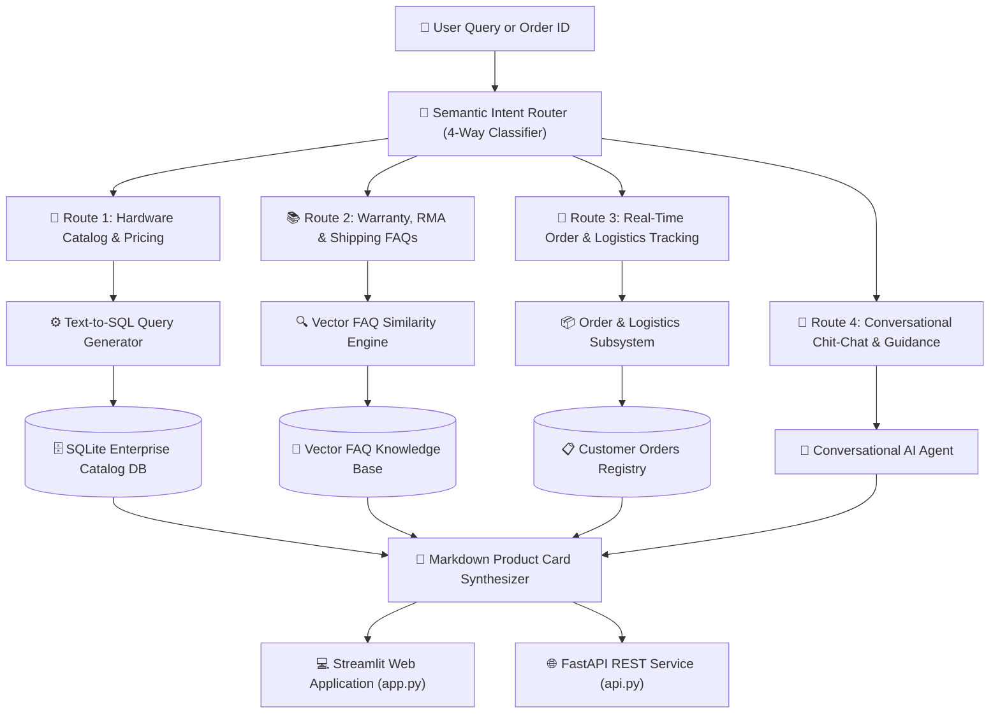

# 🤖 #GyanLabs-Agentic-Commerce-Chatbot: Enterprise AI Hardware & Cloud Infrastructure Assistant

[](https://www.python.org/)
[](https://streamlit.io/)
[](https://fastapi.tiangolo.com/)
[](https://www.sqlite.org/)
[](https://github.com/langchain-ai/langchain)
[](https://opensource.org/licenses/MIT)

> [!NOTE]
> **Educational & Research Demonstration Disclaimer:**  
> This project, including the fictitious enterprise identity ("#Gyan Labs / HashGyan Technologies"), simulated AI server catalogs, pricing tiers, and sample customer logistics records, is developed exclusively for **educational, instructional, open-source portfolio demonstration, and conversational AI research**. All hardware configurations and order tracking IDs are synthetically generated. Any resemblance to real entities is purely coincidental.

**#GyanLabs-Agentic-Commerce-Chatbot** is an enterprise-grade, multi-route conversational AI assistant engineered for high-performance AI hardware and cloud compute procurement. It features **semantic query intent routing**, **natural language Text-to-SQL catalog querying**, **vector-based warranty & policy FAQ retrieval**, and **real-time carrier order tracking** across North American logistics hubs.

---

## 🌟 Multi-Route System Architecture



---

## 🚀 Key Subsystems & Capabilities

| Subsystem | Technical Implementation | Description |
| :--- | :--- | :--- |
| **🎯 Semantic Intent Router** | `CommerceSemanticRouter` | Classifies user queries across 4 distinct execution paths with sub-5ms latency and confidence scoring. |
| **📊 Natural Language Text-to-SQL** | `SQLGenerator`, `DatabaseManager` | Translates natural language requests into safe, read-only SQLite queries over GPU servers, workstations, and peripherals. |
| **🛒 Product Card Comprehension** | `ProductComprehensionEngine` | Formats SQL outputs into executive markdown cards with specs, prices, discount badges, and links. |
| **📚 Vector FAQ & Policy Engine** | `VectorFAQEngine` | Cosine similarity semantic search over enterprise warranties, Net-30 payment terms, and RMA return procedures. |
| **📦 Real-Time Order Tracking** | `OrderTracker` | Extracts tracking numbers and order IDs to query real-time transit status, carriers (FedEx, UPS, Canada Post), and delivery dates. |
| **💬 Conversational Agent** | `SmallTalkAgent` | Provides friendly conversational interactions, capabilities overview, and platform guidance. |
| **⚡ Zero-Dependency Fallback** | `DenseVectorEngine` | Operates completely offline with zero mandatory cloud API keys or heavy GPU runtimes. |

---

## 📁 Repository Structure

```text
Project HashGyan/Chatbot/
├── data/                            # Enterprise catalog and FAQ datasets
│   ├── enterprise_catalog.db        # SQLite database (Products & Orders tables)
│   └── enterprise_faqs.csv          # 10+ detailed hardware and warranty FAQs
├── src/                             # Core Python Engine
│   ├── __init__.py
│   ├── config.py                    # Global configurations & constants
│   ├── router/                      # Semantic Intent Routing
│   │   ├── __init__.py
│   │   └── semantic_router.py       # 4-Route query classifier
│   ├── catalog_sql/                 # Text-to-SQL Catalog Subsystem
│   │   ├── __init__.py
│   │   ├── db_manager.py            # SQLite schema setup & catalog seeder
│   │   ├── sql_generator.py         # Natural Language to SQL converter
│   │   └── comprehension.py         # Tabular data synthesis into product cards
│   ├── faq_engine/                  # Policy & Warranty FAQ Subsystem
│   │   ├── __init__.py
│   │   └── vector_faq.py            # Dense vector semantic similarity search
│   ├── order_tracker/               # Logistics & Order Tracking Subsystem
│   │   ├── __init__.py
│   │   └── tracker.py               # Order status lookup by ID / tracking #
│   ├── smalltalk/                   # Conversational Smalltalk Subsystem
│   │   ├── __init__.py
│   │   └── agent.py                 # Identity & guidance agent
│   └── pipeline.py                  # Central enterprise orchestrator
├── tests/
│   ├── __init__.py
│   └── test_chatbot_services.py     # Comprehensive Pytest test suite
├── app.py                           # Interactive Streamlit Web Application
├── api.py                           # FastAPI REST API microservice
├── run_app.bat                      # Windows launcher script
├── pyproject.toml                   # Packaging metadata
├── requirements.txt                 # Frozen dependencies
├── .env.example                     # Sample environment file
├── LICENSE                          # MIT License
└── README.md                        # Documentation & architecture guides
```

---

## ⚡ Quickstart & Installation

### 1. Clone & Set Up Virtual Environment

```bash
git clone https://github.com/Harish-Mathematican/GyanLabs-Agentic-Commerce-Chatbot.git
cd GyanLabs-Agentic-Commerce-Chatbot

python -m venv .venv
# Windows:
.venv\Scripts\activate
# macOS/Linux:
source .venv/bin/activate
```

### 2. Install Dependencies

```bash
pip install -r requirements.txt
```

### 3. Configure Environment (Optional)

Create a `.env` file (or copy `.env.example`):
```ini
GROQ_API_KEY=your_groq_api_key_here
DEFAULT_LLM_MODEL=llama-3.3-70b-versatile
```
*(If no API keys are provided, the system automatically uses the internal zero-dependency synthesizer!)*

---

## 🖥️ Launching the Application

### Option A: Launch Streamlit Dashboard
```bash
streamlit run app.py
```
*(Or double-click `run_app.bat` on Windows)*

👉 Open **`http://localhost:8501`** in your browser.

### Option B: Launch FastAPI REST Microservice
```bash
python api.py
```
👉 Open Swagger API Docs at **`http://localhost:8001/docs`**.

---

## 🧪 Testing & Verification

Run the automated Pytest test suite:
```bash
python -m pytest tests/ -v
```

---

## 🏷️ Sample Test Prompts

* **Hardware Search:** `"Show me NVIDIA HGX H100 and H200 GPU servers"`
* **Price Filter:** `"Show developer workstations under 10000 USD"`
* **Warranty Policy:** `"What is the warranty and RMA policy on GPU servers?"`
* **Order Tracking:** `"Track status of order GL-ORD-8821"` (or `GL-ORD-8822`)
* **Shipping Policy:** `"How fast is shipping to Canada and the United States?"`

---

## 📜 License

Distributed under the [MIT License](LICENSE).  
Developed by **Harish Dhakal** (#Gyan Labs AI Systems Demo).
